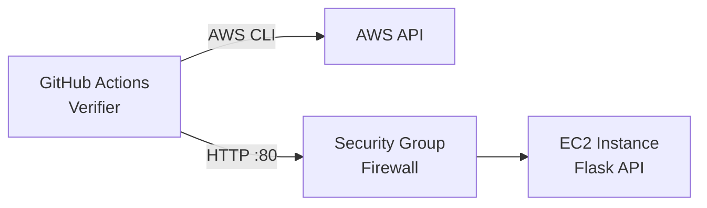

[](https://classroom.github.com/a/FxjESjFg)
# Assignment: EC2 Web Server

⚠️ **Important: Shut Down Your EC2 Instance When Finished** ⚠️
When you complete this lab, be sure to **stop or terminate your EC2 instance** from the AWS console.
Leaving it running will consume your free-tier credits and may impact your account.

---

## Overview

**Goal:** You will launch an EC2 instance, install Python and Flask, create a simple health check API, and configure GitHub Actions to verify your deployment is working.



## Requirements

- AWS Account with Free Tier access
- GitHub account
- SSH client (Terminal on Mac/Linux, PowerShell or PuTTY on Windows)

---

## Part 1: Launch EC2 Instance

### 1.1 Create a Key Pair

1. Go to **EC2 Dashboard** --> **Key Pairs** (under Network & Security)
2. Click **Create key pair**
3. Name: `cs1660-key` (or your preferred name)
4. Key pair type: **RSA**
5. Private key format: **.pem** (Mac/Linux) or **.ppk** (Windows/PuTTY)
6. Click **Create key pair** and save the downloaded file securely

**Important:** You cannot download this key again. Store it safely.

### 1.2 Create a Security Group

1. Go to **EC2 Dashboard** --> **Security Groups** (under Network & Security)
2. Click **Create security group**
3. Configure:
    - Security group name: `flask-server-sg`
    - Description: `SSH and HTTP access for Flask server`
    - VPC: Leave as default

4. Add **Inbound rules**:

| Type | Port | Source | Description |
|------|------|--------|-------------|
| SSH | 22 | My IP | SSH access from your machine |
| HTTP | 80 | 0.0.0.0/0 | HTTP access from anywhere |

5. Verify **Outbound rules** allow all traffic (this is the default):

| Type | Protocol | Port | Destination                      |
|------|----------|------|----------------------------------|
| HTTP | 443      | 0.0.0.0/0 | HTTPS egress traffic to anywhere |

**we need an outbound rule on 443 to download python deps over HTTPS.** 

6. Click **Create security group**

### 1.3 Launch the Instance

1. Go to **EC2 Dashboard** --> **Launch instance**
2. Configure:
    - **Name:** `flask-server`
    - **AMI:** Ubuntu Server 24.04 LTS (Free tier eligible)
    - **Instance type:** t3.micro (Free tier eligible)
    - **Key pair:** Select the key pair you created
    - **Network settings:** Click **Edit**, then select existing security group `flask-server-sg`
3. Click **Launch instance**
4. Note your instance's **Public IPv4 address** and **Instance ID** from the console

---

## Part 2: Connect and Configure

### 2.1 Connect via SSH

```bash
# set permissions on key file (Mac/Linux only)
chmod 400 ~/Downloads/cs1660-key.pem

# connect to your instance
# note: replace your YOUR_PUBLIC_IP with your IP address
ssh -i ~/Downloads/cs1660-key.pem ubuntu@YOUR_PUBLIC_IP
```

### 2.2 Install Dependencies

```bash
# update packages
sudo apt update && sudo apt upgrade -y

# install Python and pip
sudo apt install -y python3 python3-pip python3-venv

# verify installation
python3 --version
pip3 --version
```

---

## Part 3: Create Flask API

### 3.1 Set Up Project

```bash
# create project directory
mkdir ~/flask-api
cd ~/flask-api

# create virtual environment
python3 -m venv .venv
source .venv/bin/activate

# install Flask
pip install flask
```

### 3.2 Create the Application

Create a file named `app.py`:

```bash
touch app.py
```

Add the following code with either Vim or nano choose your own adventure:

```python
from flask import Flask, jsonify
import socket
from datetime import datetime, timezone

app = Flask(__name__)

@app.route('/health', methods=['GET'])
def health():
    return jsonify({
        "status": "healthy",
        "timestamp": datetime.now(timezone.utc).isoformat(),
        "hostname": socket.gethostname()
    }), 200

@app.route('/', methods=['GET'])
def index():
    return jsonify({
        "message": "Welcome to Cloud Computing",
        "endpoints": {
            "health": "/health"
        }
    }), 200

if __name__ == '__main__':
    app.run(host='0.0.0.0', port=80)
```

### 3.3 Run the Server

Flask needs root privileges to bind to port 80:

```bash
sudo ~/flask-api/.venv/bin/python app.py
```

### 3.4 Test Locally

In a new SSH session (keep the server running):

```bash
curl http://localhost/health
```

You should see:

```json
{"hostname":"ip-xxx-xxx-xxx-xxx","status":"healthy","timestamp":"2025-01-28T..."}
```

### 3.5 Test from Your Machine

Open a browser or terminal on your local machine:

```bash
curl http://YOUR_PUBLIC_IP/health
```

If this works, your server is publicly accessible.

---

## Part 4: Run as Background Service

To keep the server running after you disconnect:

### Using nohup to run in the background

```bash
sudo nohup ~/flask-api/.venv/bin/python ~/flask-api/app.py > ~/flask-api/server.log 2>&1 &

# test in the same terminal
curl localhost
```

---

## Part 5: Create IAM User for GitHub Actions

### 5.1 Create IAM User

1. Go to **IAM** in the AWS Console
2. Click **Users** --> **Create user**
3. User name: `github-actions`
4. Click **Next**
5. Select **Attach policies directly**
6. Search for and select: `AmazonEC2ReadOnlyAccess`
7. Click **Next** --> **Create user**

### 5.2 Create Access Keys

1. Click on the user `github-actions`
2. Go to **Security credentials** tab
3. Under **Access keys**, click **Create access key**
4. Select **Third-party service**
5. Check the confirmation box, click **Next**
6. Click **Create access key**
7. **Copy both values** (you won't see the secret again):
    - Access key ID
    - Secret access key

---

## Part 6: GitHub Actions Verification

### 6.1 Clone Your Assignment Repository

Accept the GitHub Classroom assignment link (provided in Canvas) and clone your repository.

### 6.2 Add GitHub Secrets

1. Go to your repository on GitHub
2. Navigate to **Settings** --> **Secrets and variables** --> **Actions**
3. Click the **Secrets** tab
4. Add the following secrets (click **New repository secret** for each):

| Secret Name | Value |
|-------------|-------|
| `AWS_ACCESS_KEY_ID` | Your IAM user access key ID |
| `AWS_SECRET_ACCESS_KEY` | Your IAM user secret access key |

### 6.3 Add GitHub Variables

1. Still in **Settings** --> **Secrets and variables** --> **Actions**
2. Click the **Variables** tab
3. Click **New repository variable** and add:

| Variable Name | Value |
|---------------|-------|
| `EC2_PUBLIC_IP` | Your EC2 instance's public IP (no http://) |
| `EC2_INSTANCE_ID` | Your EC2 instance ID (e.g., i-0abc123def456) |

### 6.4 Trigger the Workflow

Push an empty commit to trigger the workflow:

```bash
git commit --allow-empty -m "trigger verification workflow"
git push
```

Or manually trigger it:
1. Go to the **Actions** tab in your repository
2. Select the **Verify Flask Server** workflow
3. Click **Run workflow**

### 6.5 Verify Success

Check the **Actions** tab for a green checkmark. If the workflow fails, review the logs for troubleshooting hints.

---

## Deliverables

Submit the following to Canvas:

1. **GitHub Repository URL** (your GitHub Classroom repository)
2. **Public IP address** of your EC2 instance in an `ip.txt` file

---

## Grading Rubric

| Component | Points |
|-----------|--------|
| EC2 instance is running (verified via AWS CLI) | 3 |
| Security Group allows HTTP from anywhere (verified via AWS CLI) | 3 |
| Flask API returns valid JSON on /health endpoint | 4 |
| GitHub Actions workflow passes | 5 |
| **Total** | **15** |

---

## Troubleshooting

### Cannot connect via SSH

- Verify your Security Group allows SSH (port 22) from your IP
- Check that you're using the correct key file
- Ensure the instance is in "running" state

### pip install hangs or fails with "Network is unreachable"

- Check that your Security Group allows **all outbound traffic**
- Go to your Security Group --> **Outbound rules** --> Ensure "All traffic" to 0.0.0.0/0 exists

### Cannot reach HTTP endpoint

- Verify Security Group allows HTTP (port 80) from 0.0.0.0/0
- Confirm Flask is running: `sudo lsof -i :80`
- Check Flask is binding to 0.0.0.0, not 127.0.0.1

### GitHub Actions fails with "InvalidClientTokenId" or "SignatureDoesNotMatch"

- Verify your AWS credentials are correct in GitHub Secrets
- Make sure there are no extra spaces when copying the keys
- Check that the IAM user has `AmazonEC2ReadOnlyAccess` policy attached

### GitHub Actions fails with "InvalidInstanceID"

- Verify the `EC2_INSTANCE_ID` variable is correct (starts with `i-`)
- Check the instance exists in us-east-1 region

### GitHub Actions fails on Security Group check

- Ensure your Security Group has an inbound rule for HTTP (port 80) from 0.0.0.0/0
- The rule must allow traffic from anywhere, not just your IP

### Flask server stops when I disconnect

- Use nohup (see Part 4)
- Verify with: `curl http://localhost/health` after reconnecting

---

## Cleanup

**Important:** When you are finished with this assignment, stop or terminate your EC2 instance to avoid charges.

```bash
# find your instance ID
aws ec2 describe-instances \
  --query "Reservations[*].Instances[*].{ID:InstanceId,State:State.Name,Name:Tags[?Key=='Name']|[0].Value}" \
  --output table \
  --region us-east-1

# stop the instance
aws ec2 stop-instances --instance-ids i-xxxxxxxxxxxxxxxxx --region us-east-1
```

Or from the AWS Console: **EC2 Dashboard** --> **Instances** --> Select instance --> **Instance state** --> **Stop instance**
